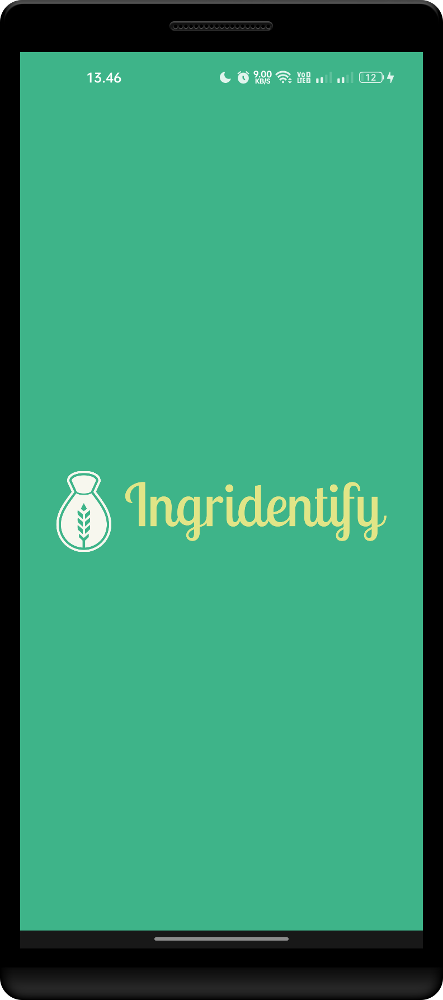
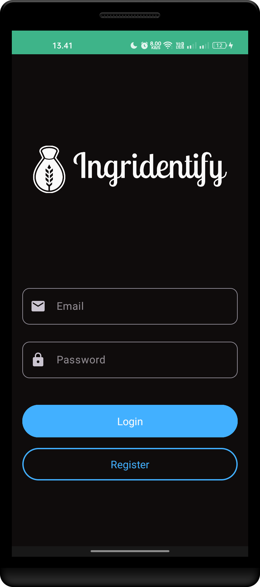
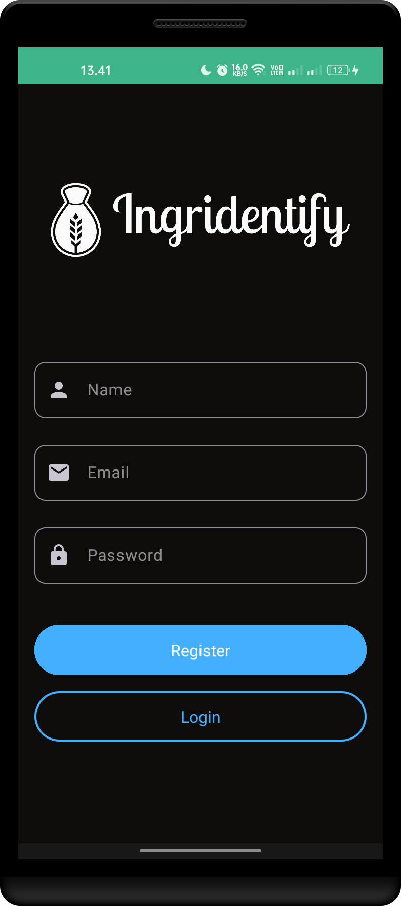
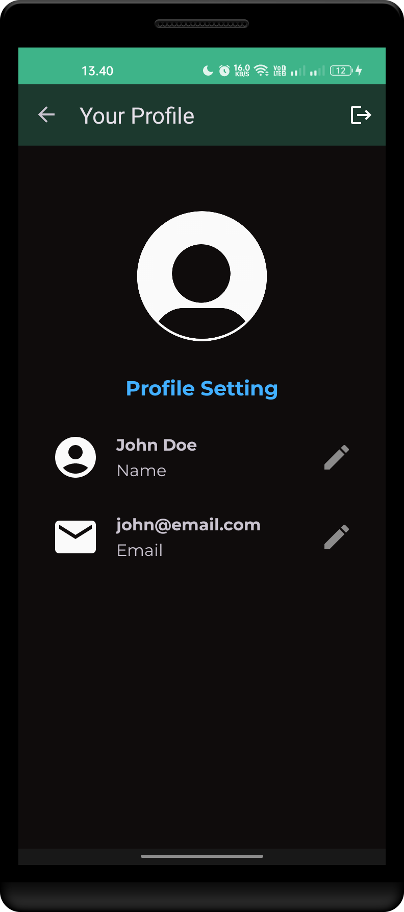
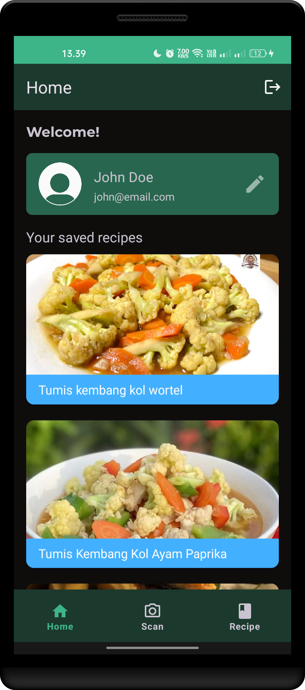
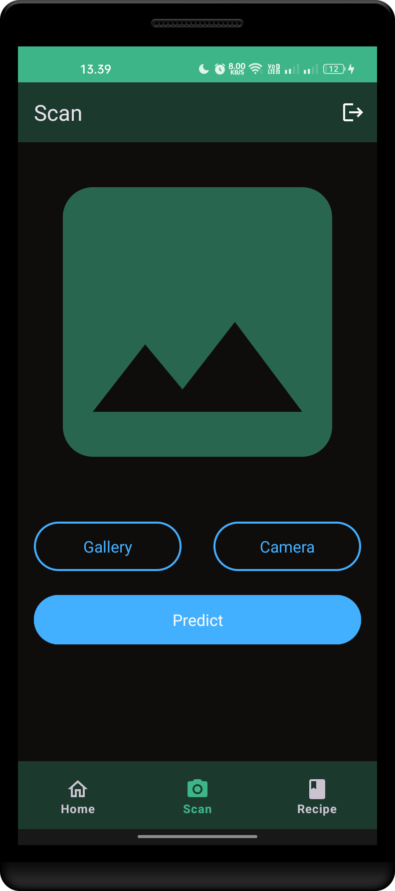
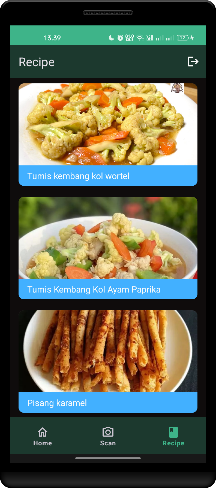
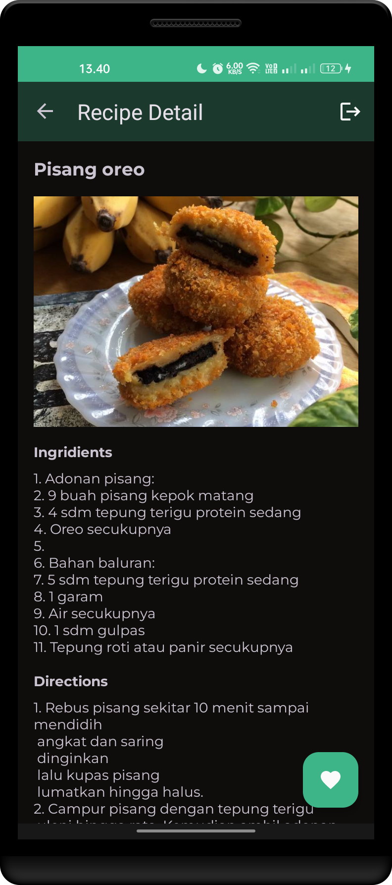

<p align="center">
  
</p>
<p align="center">
  <a href="https://github.com/Ingridentify/Ingridentify/releases">
    
  </a>
</p>
<p align="center">
  Welcome to the Ingridentify Android App repository! This app is part of the <a href="https://github.com/Ingridentify">Ingridentify project</a>, which aims to address challenges in modern meal planning, unhealthy eating habits, and food wastage. The app utilizes Machine Learning to recognize various fruits and vegetables through image scanning, providing users with personalized menu suggestions and detailed cooking recipes.
</p>

<h2 align="center">Meet the Mobile Devs</h2>

<table align="center">
  <tr>
    <td align="center">
      <a href="https://github.com/fauzan-radji">
        
      </a>
    </td>
    <td align="center">
      <a href="https://github.com/fellis-cp">
        
      </a>
    </td>
  </tr>

  <tr align="center">
    <td>Tri Putra Fauzan H. Radji<br/>(A494BSY2646)</td>
    <td>M. Hanif Fajar Anggara<br/>(A548BKY4469) </td>
  </tr>

  <tr>
    <td align="center">
      <a href="https://github.com/fauzan-radji">
        
      </a>
      <a href="https://www.linkedin.com/in/tri-putra-fauzan-h-radji-404810257/">
        
      </a>
    </td>
    <td align="center">
      <a href="https://github.com/fellis-cp">
        
      </a>
      <a href="https://www.linkedin.com/in/m-hanif-fajar-anggara-a71950278/">
        
      </a>
    </td>
  </tr>
</table>

## Features

- **Ingredient Recognition:** Utilizes Machine Learning to identify various fruits and vegetables through image scanning.
- **Personalized Menu Suggestions:** Offers users personalized menu suggestions based on their pantry items.
- **Detailed Cooking Recipes:** Provides step-by-step cooking recipes for a diverse culinary experience.

## Screenshots

<p align="center">
  
  
  
  
  
  
  
  
</p>

## Getting Started

To get started with the Ingridentify Android App, follow these steps:

1. **Clone the Repository:**

   ```bash
   git clone https://github.com/Ingridentify/android-app.git Ingridentify
   ```

2. **Open in Android Studio:**
   Open the project in Android Studio and ensure you have the necessary dependencies installed.

3. **Set Base URL:**
   In the `local.properties` file, set the `BASE_URL` and `ML_URL` to the base URL of the Ingridentify API and ML API respectively.

   ```properties
   BASE_URL=https://ingridentify-api-xb5hnzr2ba-et.a.run.app/ingridentify/
   ML_URL=https://ml-api-xb5hnzr2ba-et.a.run.app/ingridentify/
   ```

4. **Build and Run:**
   Build and run the app on your Android device or emulator.

## Project Structure

The rough project structure is as follows:

```
app
├── manifests
│   └── AndroidManifest.xml
├── java
│   └── com.ingridentify
│       ├── components
│       |   ├── EmailEditText.kt
│       |   └── PasswordEditText.kt
│       ├── data
│       |   ├── datastore
│       |   |   └── UserPreference.kt
│       |   ├── local
│       |   |   ├── dao
|       |   |   |   └── RecipeDao.kt
│       |   |   ├── entity
|       |   |   |   └── RecipeEntity.kt
│       |   |   └── IngridentifyDatabase.kt
│       |   ├── model
│       |   |   ├── RecipeModel.kt
│       |   |   └── UserModel.kt
│       |   ├── paging
│       |   |   └── RecipeAdapter.kt
│       |   ├── remote
│       |   |   ├── response
|       |   |   |   ├── DetailResponse.kt
|       |   |   |   ├── ErrorResponse.kt
|       |   |   |   ├── LoginResponse.kt
|       |   |   |   ├── PredictResponse.kt
|       |   |   |   ├── RecipeResponse.kt
|       |   |   |   └── RegisterResponse.kt
│       |   |   └── retrofit
|       |   |       ├── ApiConfig.kt
|       |   |       ├── ApiService.kt
|       |   |       └── MLService.kt
│       |   ├── Repository.kt
│       |   └── Result.kt
│       ├── di
│       |   └── Injection.kt
│       ├── ui
│       |   ├── add
│       |   |   ├── AddFragment.kt
│       |   |   ├── AddViewModel.kt
│       |   |   └── CameraFragment.kt
│       |   ├── auth
│       |   |   └── AuthActivity.kt
│       |   ├── detail
│       |   |   ├── DetailFragment.kt
│       |   |   └── DetailViewModel.kt
│       |   ├── home
│       |   |   ├── HomeFragment.kt
│       |   |   └── HomeViewModel.kt
│       |   ├── login
│       |   |   ├── LoginFragment.kt
│       |   |   └── LoginViewModel.kt
│       |   ├── main
│       |   |   ├── MainActivity.kt
│       |   |   └── MainViewModel.kt
│       |   ├── profile
│       |   |   ├── ProfileFragment.kt
│       |   |   └── ProfileViewModel.kt
│       |   ├── recipe
│       |   |   ├── RecipeFragment.kt
│       |   |   └── RecipeViewModel.kt
│       |   ├── register
│       |   |   ├── RegisterFragment.kt
│       |   |   └── RegisterViewModel.kt
│       |   ├── SplashActivity.kt
│       |   └── ViewModelFactory.kt
│       └── utils
│           ├── Converter.kt
│           ├── FileUtils.kt
│           └── UiUtils.kt
└── res
    ├── drawable
    |   ├── bg_text.xml
    |   ├── bg_text2.xml
    |   ├── fruit.jpg
    |   ├── ic_account_circle.xml
    |   ├── ic_book.xml
    |   ├── ic_bottom_camera.xml
    |   ├── ic_bottom_home.xml
    |   ├── ic_bottom_recipe.xml
    |   ├── ic_camera_filled.xml
    |   ├── ic_camera_outlined.xml
    |   ├── ic_camera_switch.xml
    |   ├── ic_circle.xml
    |   ├── ic_edit.xml
    |   ├── ic_email.xml
    |   ├── ic_favorite_filled.xml
    |   ├── ic_favorite_outlined.xml
    |   ├── ic_home_filled.xml
    |   ├── ic_home_outlined.xml
    |   ├── ic_lock.xml
    |   ├── ic_logout.xml
    |   ├── ic_person.xml
    |   ├── ic_placeholder.xml
    |   ├── profile.xml
    |   ├── typography (2)
    |   |   ├── typography.png
    |   |   └── typography.png (night)
    |   └── typography_color.png
    ├── font
    |   ├── montserrat_black.xml
    |   ├── montserrat_bold.xml
    |   ├── montserrat_extra_bold.xml
    |   ├── montserrat_extra_light.xml
    |   ├── montserrat_light.xml
    |   ├── montserrat_medium.xml
    |   ├── montserrat_regular.xml
    |   ├── montserrat_semi_bold.xml
    |   └── montserrat_thin.xml
    ├── layout
    |   ├── activity_auth.xml
    |   ├── activity_main.xml
    |   ├── activity_splash.xml
    |   ├── card_recipe.xml
    |   ├── fragment_add.xml
    |   ├── fragment_camera.xml
    |   ├── fragment_detail.xml
    |   ├── fragment_home.xml
    |   ├── fragment_login.xml
    |   ├── fragment_profile.xml
    |   ├── fragment_recipe.xml
    |   └── fragment_register.xml
    ├── menu
    |   ├── bottom_nav_menu.xml
    |   └── main_menu.xml
    ├── mipmap
    |   ├── ic_launcher (6)
    |   |   ├── ic_launcher.webp (hdpi)
    |   |   ├── ic_launcher.webp (mdpi)
    |   |   ├── ic_launcher.webp (xhdpi)
    |   |   ├── ic_launcher.webp (xxhdpi)
    |   |   ├── ic_launcher.webp (xxxhdpi)
    |   |   └── ic_launcher.xml (anydpi-v26)
    |   ├── ic_launcher_foreground (5)
    |   |   ├── ic_launcher_foreground.webp (hdpi)
    |   |   ├── ic_launcher_foreground.webp (mdpi)
    |   |   ├── ic_launcher_foreground.webp (xhdpi)
    |   |   ├── ic_launcher_foreground.webp (xxhdpi)
    |   |   ├── ic_launcher_foreground.webp (xxxhdpi)
    |   └── ic_launcher_round (6)
    |       ├── ic_launcher_round.webp (hdpi)
    |       ├── ic_launcher_round.webp (mdpi)
    |       ├── ic_launcher_round.webp (xhdpi)
    |       ├── ic_launcher_round.webp (xxhdpi)
    |       ├── ic_launcher_round.webp (xxxhdpi)
    |       └── ic_launcher_round.xml (anydpi-v26)
    ├── navigation
    |   ├── auth_navigation.xml
    |   └── main_navigation.xml
    ├── values
    |   ├── attrs.xml
    |   ├── colors.xml
    |   ├── ic_launcher_background.xml
    |   ├── strings.xml
    |   └── themes (2)
    |       ├── themes.xml
    |       └── themes.xml (night)
    └── xml
        ├── backup_rules.xml
        └── data_extraction_rules.xml

Gradle Scripts
├── build.gradle.kts (Project: Ingridentify)
├── build.gradle.kts (Module: app)
├── proguard-rules.pro (ProGuard Rules for ":app")
├── gradle.properties (Project Properties)
├── gradle-wrapper.properties (Gradle Version)
├── local.properties (SDK Location)
└── settings.gradle.kts (Project Settings)
```

## Dependencies

The Ingridentify Android App utilizes the following dependencies:

- AndroidX Core KTX: 1.12.0
- AndroidX AppCompat: 1.6.1
- Google Android Material: 1.11.0
- AndroidX ConstraintLayout: 2.1.4
- AndroidX Navigation Fragment KTX: 2.7.6
- AndroidX Navigation UI KTX: 2.7.6
- AndroidX Camera Camera2: 1.3.1
- AndroidX Camera View: 1.3.1
- AndroidX Camera Lifecycle: 1.3.1
- Retrofit: 2.9.0
- Retrofit Converter Gson: 2.9.0
- OkHttp3 Logging Interceptor: 5.0.0-alpha.11
- AndroidX Lifecycle LiveData KTX: 2.7.0-rc02
- AndroidX DataStore Preferences: 1.1.0-alpha07
- CircleImageView: 3.1.0
- AndroidX Paging Runtime KTX: 3.1.1
- AndroidX Room Paging: 2.6.0
- AndroidX Room KTX: 2.6.0
- Glide: 5.0.0-rc01
- AndroidX Room Compiler: 2.6.0 (for Kotlin Symbol Processing)

## Issues

If you encounter any issues or have suggestions, feel free to open an issue on the [Issue Tracker](https://github.com/Ingridentify/android-app/issues).

## Acknowledgments

We would like to express our gratitude to everyone contributing to the Ingridentify project. Together, we are making strides towards healthier and more sustainable living.

Happy Cooking! :cookie:
